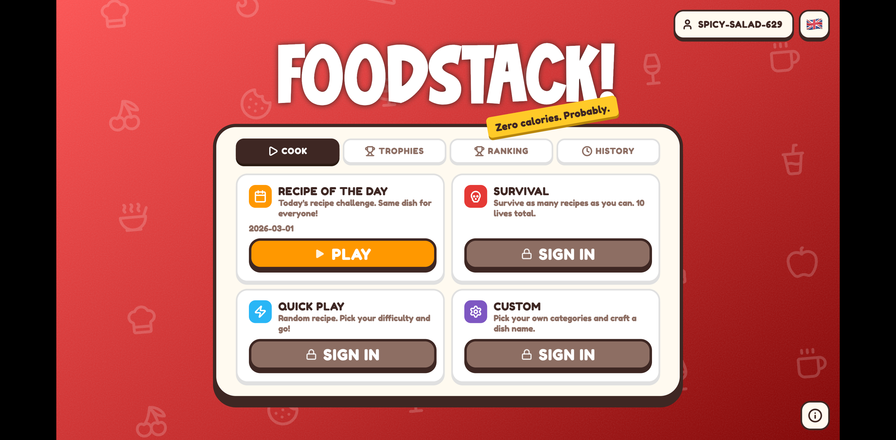
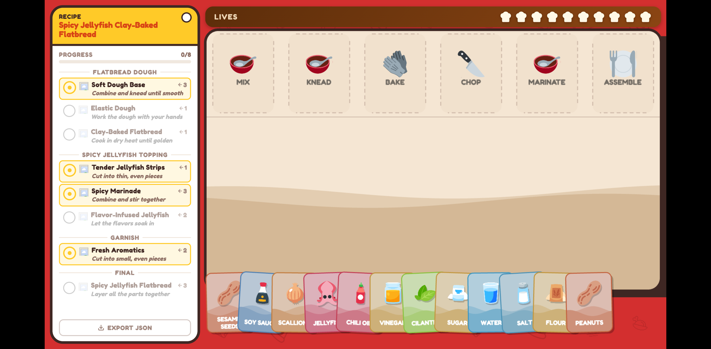
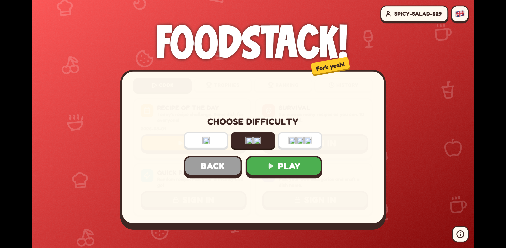
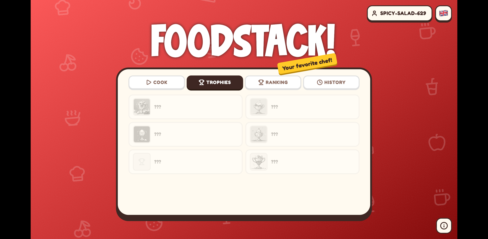
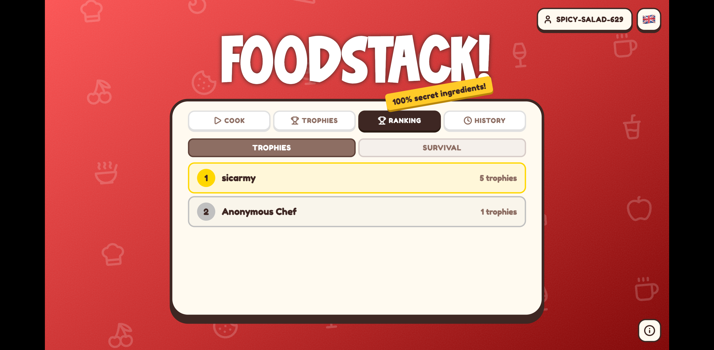
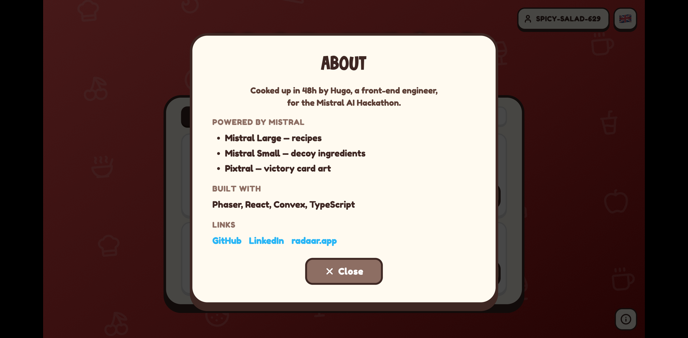

# Foodstack!

A card-based cooking puzzle game powered by Mistral AI. Built in 48 hours for the **Mistral AI Hackathon**.



## How to Play

Foodstack is a recipe assembly puzzle. Each round, Mistral AI generates a unique recipe as a **tree of cooking steps** — your job is to drag the right ingredient cards onto the right processors (cooking actions) in the correct order to complete the dish.

### The Board



- **Processors** (top row) — cooking actions like Mix, Knead, Bake, Chop, Marinate, Assemble. Each one expects specific ingredients.
- **Hand** (bottom) — your ingredient cards. Drag them onto the matching processor to advance the recipe.
- **Quest Book** (left panel) — the full recipe tree broken into branches (e.g. "Flatbread Dough", "Spicy Jellyfish Topping", "Garnish"). Shows which steps are completed and what comes next.
- **Lives** (top) — you start with a limited number of lives. Each wrong ingredient costs one.

### Step by Step

1. **Read the recipe** — The quest book shows every step: what goes in, what comes out, and which processor to use.
2. **Drag ingredients** — Pick a card from your hand and drop it onto the right processor.
3. **Chain results** — When all inputs for a step are placed, it "cooks" and produces an intermediate card that feeds into the next step.
4. **Watch out for decoys** — Some cards in your hand don't belong in the recipe. Using them costs a life and produces a cursed error item.
5. **Complete the dish** — Work through all branches until you reach the final assembly step.

### Difficulty



- **Easy** — 4 processors, fewer ingredients, simpler recipe tree
- **Medium** — 5-6 processors, more branching
- **Hard** — 6-7 processors, complex multi-branch recipes with more decoys

## Game Modes

| Mode | Description |
|------|-------------|
| **Recipe of the Day** | Same dish for everyone, every day. Compete for the fewest errors. |
| **Survival** | 10 lives across multiple rounds. How many recipes can you clear? |
| **Quick Play** | Random recipe, pick your difficulty, go. |
| **Custom** | Choose your own categories and craft a dish name. |

## How Mistral AI Powers the Game

Every game of Foodstack is dynamically generated by three Mistral models working together:

### Mistral Large — Recipe Generation

The core game engine. When you start a game, Mistral Large generates a complete recipe as a structured tree:

- Branches (e.g. "Dough Prep", "Sauce", "Garnish")
- Steps within each branch, each with a processor, required inputs, and output
- Ingredient lists with food sprite IDs and colors
- Decoy ingredients that look plausible but don't belong

The model follows strict constraints per difficulty level (number of processors, branching depth, ingredient count) and outputs structured JSON validated against a Zod schema.

### Mistral Small — Decoy Ingredients & Translations

Handles two key features:

- **Error combinations** — When you drop the wrong ingredient onto a processor, Mistral Small generates a humorous "cursed" result name and emoji in real time (e.g. dropping sugar into a grill might produce "Caramel Catastrophe" with a nauseated emoji).
- **Localization** — Recipes are generated in English, then Mistral Small translates the full recipe tree (ingredient names, step descriptions, branch titles) into the player's language while preserving the game structure.
- **Real recipe generation** — After winning, you can generate an actual edible recipe for the dish you just completed.

### Pixtral — Victory Card Art

When you complete a dish, Pixtral generates a unique trophy illustration:

- Cartoon-style trophy card featuring the dish's hero ingredients
- Difficulty-specific visual themes (cute/bubbly for easy, cheerful for medium, epic/triumphant for hard)
- Images are cached per dish + difficulty so they're reused across players

## Trophy Collection



Every completed dish earns a trophy in your collection. The trophy dex tracks:

- Which dishes you've completed and at what difficulties
- Your best score (fewest errors) per dish
- The AI-generated victory card art
- Global completion counts across all players

## Leaderboard



Two leaderboards:

- **Trophies** — ranked by unique dishes completed
- **Survival** — ranked by max rounds survived

## Tech Stack

| Layer | Technology |
|-------|-----------|
| Game Engine | [Phaser 3](https://phaser.io/) |
| UI Layer | React 19 |
| Language | TypeScript |
| Backend | [Convex](https://convex.dev/) |
| AI | [Mistral AI](https://mistral.ai/) (Large, Small, Pixtral) |
| Bundler | Vite |
| Package Manager | pnpm |

## Development

```bash
# Install dependencies
pnpm install

# Start the dev server
pnpm dev

# In a separate terminal, start the Convex backend
npx convex dev

# Type checking
pnpm typecheck

# Lint
pnpm lint

# Format
pnpm format
```

### Environment Setup

1. Run `npx convex dev` to generate `convex/_generated/` and get your `CONVEX_URL`
2. Create `.env` with `VITE_CONVEX_URL=<your convex url>`
3. Set your Mistral API key: `npx convex env set MISTRAL_API_KEY <key>`

## About



Made by [Hugo Massing](https://www.linkedin.com/in/hugomassing) — [GitHub](https://github.com/hugomassing) | [radaar.app](https://radaar.app)
